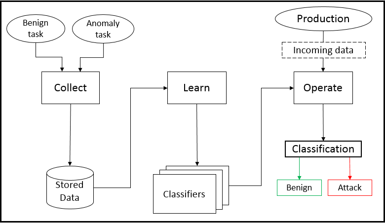

# ROS Anomaly Detector package


# Overview

<!-- The high level ROS Anomaly Detector Module (ADM) goal is -->

The ROS Anomaly Detector Module (ADM) is designed to execute alongside
industrial manufacturing tasks to detect unintended deviations of an
industrial arm at the application level. The ADM utilizes a learning based
technique to achieve this. The process has been made efficient by building the
ADM as a ROS application that aptly fits in the ROS ecosystem. While this
module is specific to anomaly detection for an industrial arm, it is extensible
to other projects with similar goals. This serves as a starting point.

The crux of anomaly detection within this module relies on a three step
process. The steps includes creating datasets out of the published messages
within ROS, learning models from those datasets, and deploying it in
production. Appropriately, the ROS ADM can be executed in three different modes
that correspond to the three step process. The following image presents the
high level workflow that is meant to be followed.



<!-- To evaluate our anomaly detection methodology we considered an industrial arm
programmed and controlled with ROS. We developed a ROS Anomaly Detection Module
(ADM) that is designed to execute alongside manufacturing tasks to detect
unintended arm deviations. ADM can be executed in three different modes for
collecting data (Collect mode), learning models (Learn mode), and detecting
anomalies (Operate mode). -->


<!-- % % Also important, the IDM is designed to integrate well
% % with the development of any ROS application.
% The IDM addresses the integrity of the industrial arm task by
% monitoring the captured joint states that are relayed back to the
% control system from the sensors. At any given point, when the joints
% have progressed into an unseen state, they should be marked anomalous.

% % [\idea{Start talking about the IDM and what it does.}]

% The crux of intrusion detection within our proposed
% method relies on a three step process. The steps include gathering
% messages that are published in ROS, using that data to build a
% learning model, and finally using that model in the production phase
% to classify the arm's behavior. Appropriately, the ROS IDM can be
% executed in three different modes that correspond to the three step
% process. Fig. \ref{fig:idm_flow} presents the high level workflow of
% the IDM. Labeled data is collected in the Collect mode. The collected
% data is utilized for learning in the Learn mode, producing trained
% classifiers. These are employed during production. -->


What are the different modes?
What happens when a mode is initialized?


- Listening mode - Collect data, specify topics.
- Training option - Use collected data and train a model.
	Needs lots of options and cover various attributes.
	How many different models?
	How much data?
	Use incoming data for training?
	The ML techniques details are here

	Split unlabeled data collection, and labeled data collection
		process to make sure correct labels are presented.

- Operational mode - Import trained model and run task.


### Learning library

- Interface
- Data Process
- Data Persist
- Anomaly Detector
- Output Matrix

---

## Dependencies

[ROS](http://wiki.ros.org/ROS/Installation) needs to be first installed

catkin build
ros related items needed

ros-core


moveit
	- ros_moveit_core
	- moveit_setup_assistant

ros industrial core
motoman driver

---

## Build

setup.py should run from home directory
specify the 'learn_lib' package to build within the src/ directory

then go back and build the whole ROS workspace
Then scripts should be able to run


```bash
	python setup.py build
```
---

## Install


```bash
	python setup.py install
```


---

## Usage

How is it included in roslaunch files?

How is it run?

```bash
	roslaunch <pkg_name> <file>.launch
```

---

## Demo

- Demo includes moveit_setup_assistant package, data collected,
	and the trained classifiers
- User should be able to use it out of the box for testing.

---

## Troubleshooting

What are the gotchas?

---

## License

BSD-3
